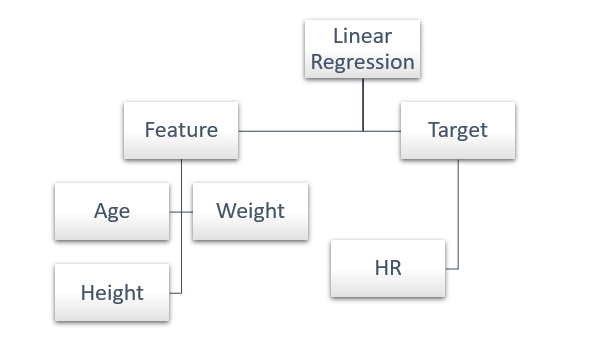

# Sliding into the MLB

## Dataset
[Lahman Baseball Database](http://seanlahman.com/download-baseball-database/)- 

[Stats as of 2022 CSV](https://github.com/chadwickbureau/baseballdatabank/archive/refs/tags/v2023.1.zip)

### Project Idea - MLB Stats based on age
- What is the HR probability of an MLB player when considering age, weight, and height?

## ER Diagram

## Tableau Dashboard
[Tableau Dashboard "working Copy"](https://public.tableau.com/views/MLBProject_16831646424700/SBonMap?:language=en-US&publish=yes&:display_count=n&:origin=viz_share_link)

## Rough Outline
- Intoduction
  - Age Range
  - Oldest player - Youngest player
  - Avg. age per team
- HR : Home runs hit/allowed
  - Line Chart
  - Box Plot
- RBI : Runs batted in
  - Line Chart
  - Box Plot
- SB : Stolen bases
  - Line Chart
  - Box Plot
- BA : Hits/at bats
  - Line Chart
  - Box Plot
- Machine Learning Module
- Conclusion

## Machine Learning
Supervised Learning Model
- Multiple Linear Regression
Predicting HR, RBIs, and BA based on player's age.

