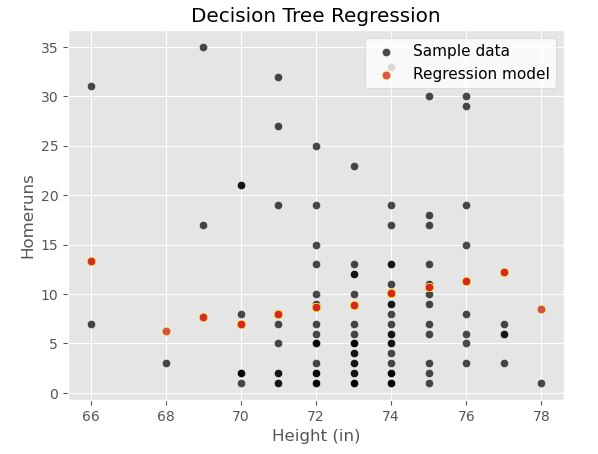
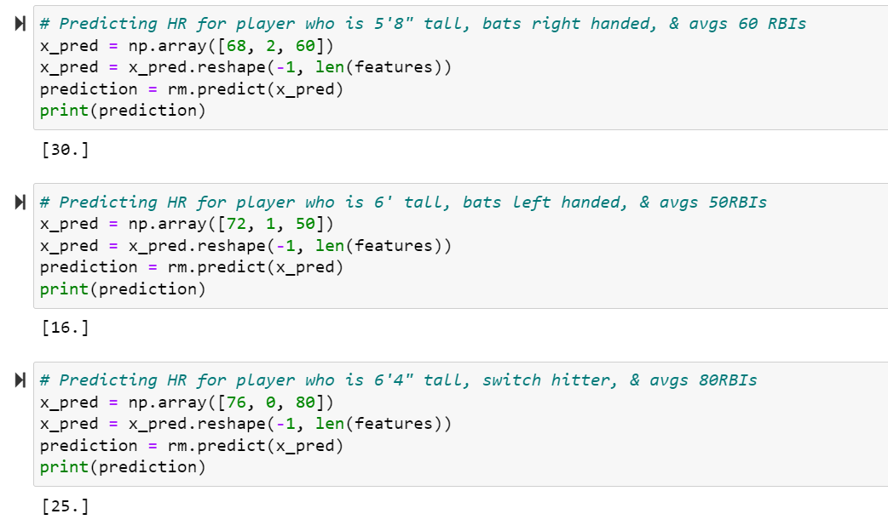

## Dataset
[Lahman Baseball Database](http://seanlahman.com/download-baseball-database/)- 

[Stats as of 2022 CSV](https://github.com/chadwickbureau/baseballdatabank/archive/refs/tags/v2023.1.zip)

## Overview
Major League Baseball (MLB) has hired us to research trends of player statistics for better performance. In a game based on numbers, we want to know how a player's features and performance impact how many homeruns they will hit a year. Our goal is to create a model that will predict how many homeruns a player can hit based on their age, weight, height, hits, runs batted in, and which side they bat on. We are focused on homeruns because scoring runs is the way that baseball games are decided. Hitting a home run is the only play guaranteed to score a run.

This will help improve the game by showing players which features they can improve on to be able to be more efficient in hitting homeruns. This can also help coaches create gameday line-ups based on which players are more susceptible to hitting homeruns. Lastly, this can help team managers make accurate predictions when deciding if they will extend a contract offer to a prospective player or a contract extension.

## ER Diagram
Our dataset had all the needed information in one table so we split the data to create a new table for our machine learning model.

## Process and Analysis
### Technology Used
- PostgreSQL/PGA Admin
- Google Slides
- Tableau
- Amazon Web Services
  - RDS
  - S3 Buckets
- Jupyter Lab/Notebook
- Python
- Boto3
- Pandas
- Matplotlib.pyplot
- SkLearn
  - DecisionTreeRegressor
  - Train_Test_Split
  - Mean_Absolute_Error
  - LabelEncoder
- Statsmodels.api
- Seaborn

## Tableau Dashboard
[Tableau Dashboard](https://public.tableau.com/views/MLBProject_16831646424700/Story1?:language=en-US&publish=yes&:display_count=n&:origin=viz_share_link)

## Draft Presentation
[PowerPoint Presentation](https://docs.google.com/presentation/d/18p30GQuymT2IiWoWPWBuGUrkOBxBS357Z4zxULx0iWU/edit?usp=sharing)

## Machine Learning
## Linear Regression
Based on our dataset, we used a multiple linear regression model to evaluate the relationship between different variables like age, height, weight, number of hits, and batting side to determine the homeruns a player can hit. We use statistics for the past 4 years in the MLB for each player. First, we used scikit learns LabelEncoder to convert our "bats" data to numerical data. We then calculated the variance inflation factor (VIF) to measure how much the behavior of our independent variables correlate with other independent variables. VIF equal to 1 means variables are not correlated. Two variables that were moderately correlated are height and weight with a 1.4 VIF. After splitting our data and training our model, our mean absolute error was a 3.7, meaning our predictions varied plus or minus 3.7 homeruns. Our coefficients showed that two variables which have a bigger impact on how many homeruns will be hit are height and how many hits a player has. This model shows age doesn't necessarily impact how many homeruns will be hit by a player. Our model showed an accuracy score of 66.5%.

### Variance Inflation Factor

### Mean Absolute Error

## Decision Tree Regression
Since our linear regression model was not performing as we hoped, we decided to change to the Decision Tree Regression Model. We added another variable that we believed would improve our results, runs batted in (RBI). 

### Variance Inflation Factor

### Mean Absolute Error

## Results

We improved our model by removing the variables that proved had no correlation with predicting homeruns, like age and weight. We reviewed our VIF score after adding RBIs and noticed the strong correlation between "Hits" and "RBIs". This led us to also remove "Hits" from the dataset to train our model. After splitting our data and training our new model, our mean absolute error decreased to 3.1 and our accuracy score increased to 85%. Meaning our model predictions may vary plus or minus 3.1 homeruns and the model explains 85% of the fitted data. RBI’s made a huge impact in our predictions as every homerun allows a run to score. Height shows a positive correlation with a coefficient of 0.21. Batting side also shows a positive correlation with homeruns with a coefficient of 0.26. Lastly, RBIs show a positive correlation with homeruns with a coefficient of 0.31.

## Predicted Results

## Recommendation for Future Analysis

One feature that could provide some important insight for future analysis would be location. It is a known fact that differences in elevation change the density of the air which has a direct correlation with the resistance on a baseball after a hit. Some stadiums at higher elevations have a known higher rate of homeruns hit in them. Players that play at these stadiums with their home teams may appear to be higher than average sluggers, when in reality it’s just the advantage of the physical location.
